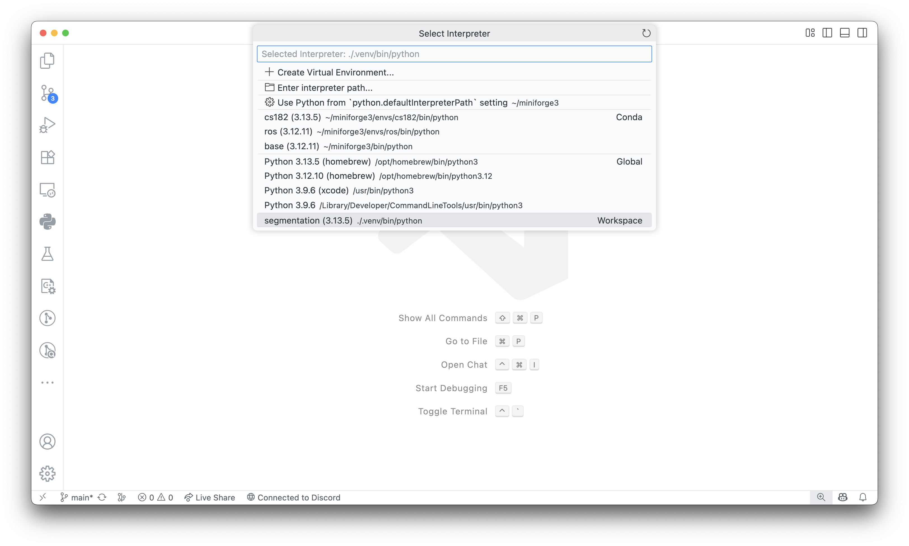

# CS182 Individual Programming Assignment 1: Segmentation

Welcome to the CS182 Arcade! Over the course of the semester we'll be taking a deeper dive into many of the topics covered in lecture through the individual and programming assignments. In particular, we will focus on how to apply the knowledge you've learned in class for agent planning and learning in games.

For this series of assignments, we're especially interested in diving deep into the topic of adversarial search.

As always, we highly recommend reading through the entire assignment and the stencil code before beginning with any parts of the assignment.

## Game

For both the individual and group portions of the assignment you'll be playing a turn-based, two-player, zero-sum game of perfect-information on a discrete gridworld. Those are a lot of keywords, so let's break it down:

-   A turn-based or sequential game is one in which players take turns or actions one after another rather than simultaneously. We'll explore simultaneous games in future assignments.
-   As the name suggests, a two-player game is one in which there are exactly two players playing against one another. For this assignment, this other player will either be against bots that the TA staff has provided (for the graded portions of this assignment) or agents that your fellow classmates have written (for the tournament)!
-   A zero-sum game is one in which any gain for one player is accompanied by a corresponding loss for the other player. Many of the classic board games that you're familiar with are zero-sum games such as Connect 4, chess, checkers, and Go.
-   A game of perfect information is one in which a player is aware of all the events that have previously happened prior to making any decision. Games of imperfect-information have hidden states unknown to a player. An agent having perfect/imperfect-information can really affect the optimal strategy of the agent! As an obvious example, Battleship would be an extremely boring game had it been one of perfect-information.
-   A game on a discrete gridworld is one in which each of the players positions are on a tiled grid.

In particular, for these assignments you are tasked to develop an agent who is able to navigate this gridworld to either (1) claim a majority of the grid or (2) eliminate the opposing agent.

### World Structure

The world is represented as a $W \times H$ discrete grid with $W$ columns and $H$ rows. Tiles in the grid are 0-indexed with the origin at the top-left corner of the grid, increasing column index going to the right, and increasing row index going down. For example, in the following grid the dark red square is located in tile (2, 12).

<center>
    

Player one and player two represented as dark red and blue rounded squares, respectively. Their associated claims are shown as transparent squares of the appropriate color. Trails are represented as circles of the appropriate color. Walls are shown as dark grey rounded squares.

</center>

Tiles can have one or more of the following attributes which represent their state on the board.

-   `EMPTY`
-   `WALL`
-   `TRAIL` (owned by either `PLAYER_ONE` or `PLAYER_TWO`)
-   `CLAIM` (owned by either `PLAYER_ONE` or `PLAYER_TWO`)
-   `PLAYER` (is either `PLAYER_ONE` or `PLAYER_TWO`)

If a cell is empty then it contains no other tile. If a cell contains a wall tile, then it does not contain a trail, claim, or player tile. A cell can have the trail/claim of at most one player. Players can not occupy the same tiles.

Players begin at a pre-defined point in the grid world within a 3x3 initial claim. If there are walls in the way, or the initial claim would go out of bounds then this claim is truncated appropriately.

### Player Movement

On a player's turn they can take one of five actions:

-   `Action.UP`
-   `Action.DOWN`
-   `Action.LEFT`
-   `Action.RIGHT`
-   `Action.STAY`

Each of these actions attempts to move the agent in the appropriate direction (other than `Action.STAY` which causes the agent to stay in place). Agents are not able to move into walls or out of the bounds of the board. If an agent attempts to do so, it forfeits its turn and stays in place.

### Claiming Tiles

As an agent moves onto tiles not currently in their claim they leave a trail behind them. When an agent moves into their claim again they "complete their trail" and claim all of the cells enclosed by their trail and claim.

<center>
    
    
</center>

### Eliminating Agents

An agent can be eliminated in one of three ways. If an agent's trail is moved into by another agent (including itself), the agent whose trail was encroached upon will be eliminated. Furthermore, if an agent moves into the tile containing the opposing agent, the opposing agent is eliminated. Finally, if an agent is contained within the newly claimed area when the opposing agent completes its trail the enclosed agent will be eliminated.

## Code Structure

This repository contains four major directories of interest: `scripts`, `src`, `tests`, and `worlds`.

### `scripts`

We've placed a variety of helpful scripts in this directory to aid in the development of your agents.

-   The `creator.py` python script provides a simple level editor to view existing worlds and create new ones to test your implementations out on. Run `creator.py -h` for more details.

### `src`

All of the code that you will be responsible for belongs here. In general, refrain from making destructive edits to the stencil code (unless otherwise indicated) to ensure compatibility with the autograder. Adding new files, functions, and methods is encouraged!

Adding additional external dependencies is not allowed; however, feel free to import any built-in Python module.

As you work through this assignment you'll find useful the exports from the `segmentation_core` package which contains all of the game logic for this assignment. All of the classes, methods, and functions are documented and can be viewed in your IDE, by looking at the type stubs located in the package (`CTRL`/`CMD`-click on the package name in VSCode), or by using the `help` command in the Python REPL. Alternatively, the doc comments have been replicated and placed in the `docs` folder of this repository.

If you have any questions about what things do/how things work please feel free to post a question on [Ed](https://edstem.org/us/courses/82550/discussion)!

### `tests`

We've provided some simple local tests to debug your implementations before submitting to the autograder on Gradescope. However, these tests are a strict subset of those on Gradescope. We recommend that you write your own tests as well!

### `worlds`

All of the TA-provided world files used for the local tests are located in this directory. We also recommend keeping your own custom made world files here for organizational purposes.

## Tasks

Before writing your own policy to play against intelligent agents, you will first defeat a simpler opponent. This initial opponent is `SlothBot`, a naive and lazy agent which always stays in place.

1. In `src/segmentation/agents/bfs_agent.py` implement the `bfs` and `get_action` methods to navigate your agent from its starting position to `SlothBot`'s position to eliminate it.

2. In `src/segmentation/agents/dfs_agent.py` implement the `dfs` and `get_action` methods to navigate your agent from its starting position to `SlothBot`'s position to eliminate it.

3. In `src/segmentation/agents/static_a_star_agent.py` implement the `a_star` and `get_action` methods to navigate your agent from its starting position to `SlothBot`'s position to eliminate it.

A new competitor enters the scene: `SnakeBot`. Unlike `SlothBot`, `SnakeBot` slithers around the grid extending its trail for as long as it possibly can before switching directions. Specifically, `SnakeBot` chooses a direction at random and continues in that direction until it reaches a wall or its own trail. At this point, `SnakeBot` choses another direction at random that won't cause it to immediately lose.

4. In `src/segmentation/agents/dynamic_a_star_agent.py` implement the `get_action` method so that it beats `SnakeBot`.

## Installation

### `uv`

#### Installing `uv`

A headache-free way to start running the starter code is via the [`uv`](https://docs.astral.sh/uv/getting-started/installation/) package manager. To install (on Mac, Linux, WSL):

```
curl -LsSf https://astral.sh/uv/install.sh | sh
```

> [!NOTE]
> The above command requires `curl` installed! You'll most likely have this installed, already but if not it should be a small `brew/apt/pacman install` away. Alternatively, if you have `wget` already installed you can use
>
> ```
> wget -qO- https://astral.sh/uv/install.sh | sh
> ```

Alternative approaches exist to install `uv` which you are invited to explore in the [Astral documentation](https://docs.astral.sh/uv/getting-started/installation/).

#### Installing Project Dependencies

One of the major superpowers of `uv` is its ability to manage different versions of Python using a combination of virtual environments and configuration files. Initialize this project's virtual environment and install all the required dependencies using

```
uv sync
```

This should install an appropriate Python version (3.13) and all the project's dependencies including `pytest`.

### Selecting your Python Interpreter

Using typed Python can highly improve your programming (and especially your debugging experience). To enable type checking in VSCode:

-   Open Settings (`CTRL`/`CMD` + `,`)
-   Search for `Type Checking Mode`
-   Set the mode to your desired level of strictness (`standard` is a good default!)

<center>
    
</center>

To ensure that all the type stubs are resolved for your installed dependencies, you have to select the correct Python interpreter. To do so:

-   Open the Command Pallette (`CTRL`/`CMD` + `SHIFT` + `P`)
-   Type and select `Python: Select Interpreter`
-   Choose the virtual environment located in the stencil directory.

<center>
    
</center>

For this to be correctly detected, be sure that the opened folder in VSCode is your cloned Github repository!

#### Running the code

To run the starter code use:

```
uv run segmentation [--help] [--world WORLD] [--agent-one AGENT_ID] [--agent-two AGENT_ID] [--headless] [--render-delay]
```

To run the provided tests (or ones you created) use:

```
uv run pytest
```

> [!NOTE]
> No sourcing required! If you prefer the virtual environment folder to not be called `.venv` then you can pass a name to the `uv venv` command. However, this would require setting the `UV_PROJECT_ENVIRONMENT` variable to this name either prior to every `uv sync` and `uv run` command, exporting the variable in every terminal session, or using some external dependency to manage your environment variables like [`direnv`](https://direnv.net/).

## Tips and Debugging

We use `pytest` to write and run tests for your assignments. `pytest` comes with a ton of handy and useful flags to help you test and debug parts of your code! Here's a list of useful flags to pass to `pytest` when debugging your assignment.

### Selecting Tests

```
pytest                      # run all tests (auto-discovery)
pytest path/                # run tests under a directory
pytest tests/test_x.py      # run tests in a file
```

### Failure Control

```
pytest -x                  # stop after first failure
pytest --maxfail=3         # stop after 3 failures
pytest --lf                # run last-failed tests only
pytest --ff                # run failures first, then the rest
pytest --sw                # stepwise: stop on first fail, resume next time
```

### Output

```
pytest -q                  # quiet (less output)
pytest -v                  # verbose (test names)
pytest -vv                 # extra verbose
pytest -s                  # don't capture stdout/stderr (show prints)
pytest -rA                 # show summary for all outcomes (reasons)
pytest -l                  # show local variables in tracebacks
pytest --tb=short          # shorter tracebacks
pytest --tb=line           # one-line tracebacks
pytest --durations=10      # show 10 slowest tests
```

### Common Combinations

```
# Fail fast with clear reasons
pytest -x -vv -rA --tb=short

# Re-run only what failed last time, show prints
pytest --lf -s -vv

# Redirecting output to a file for readability
pytest -s > foo.txt
```
