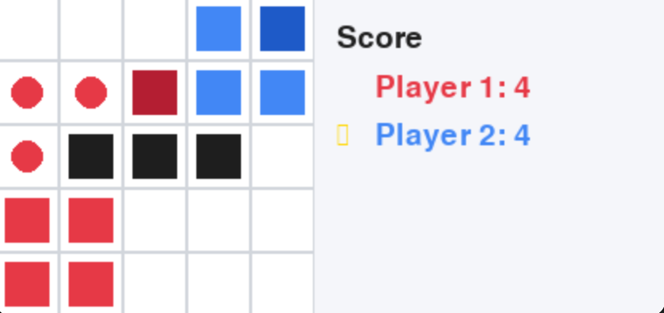
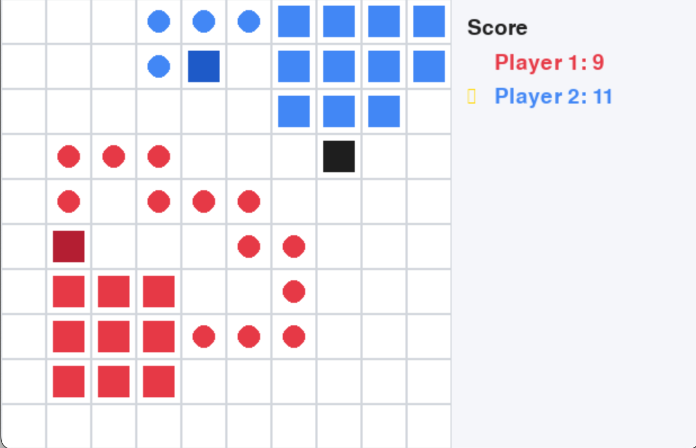
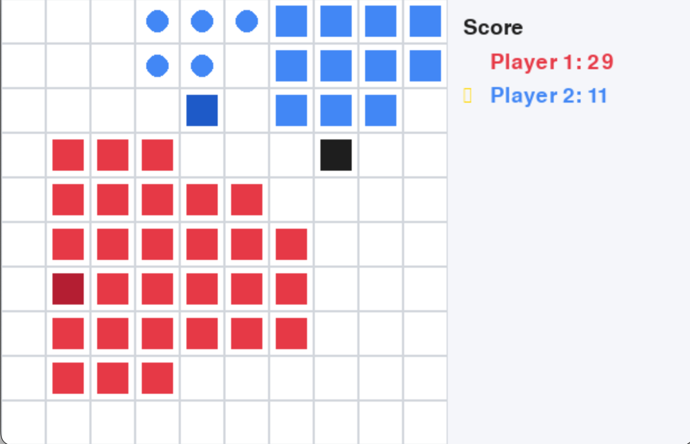

# CS182 Individual Programming Assignment 1: Segmentation

Welcome to the CS182 Arcade! Over the course of the semester we'll be taking a deeper dive into many of the topics covered in lecture through the individual and programming assignments. In particular, we will focus on how to apply the knowledge you've learned in class for agent planning and learning in "game"-like environments.

For this series of assignments, we're especially interested in diving deep into the topic of adversarial search.

As always, we highly recommend reading through the entire assignment and the stencil code before beginning with any parts of the assignment.

## Game

For both the individual and group portions of the assignment you'll be playing a <span style="color: #008b8b;">turn-based</span>, <span style="color: #ffa500;">two-player</span>, <span style="color: #008c00ff;">zero-sum</span> game of <span style="color: #0000ff;">perfect-information</span> on a <span style="color: #ff1493;">discrete gridworld</span>. Those are a lot of keywords, so let's break it down:

-   A <span style="color: #008b8b;">turn-based</span> or <span style="color: #008b8b;">sequential</span> game is one in which players take turns or actions one after another rather than simultaneously. We'll explore simultaneous games in future assignments.
-   As the name suggests, a <span style="color: #ffa500;">two-player</span> game is one in which there are exactly two players playing against one another. For this assignment, this other player will either be against bots that the TA staff has provided (for the graded portions of this assignment) or agents that your fellow classmates have written (for the tournament)!
-   A <span style="color: #008c00ff;">zero-sum</span> game is one in which any gain for one player is accompanied by a corresponding loss for the other player. Many of the classic board games that you're familiar with are zero-sum games such as Connect 4, chess, checkers, and Go.
-   A game of <span style="color: #0000ff;">perfect-information</span> is one in which a player is aware of all the events that have previously happened prior to making any decision. Games of imperfect-information have hidden states unknown to a player. An agent having perfect/imperfect-information can really affect the optimal strategy of the agent! As an obvious example, Battleship would be an extremely boring game had it been one of perfect-information.
-   A game on a <span style="color: #ff1493;">discrete gridworld</span> is one in which each of the players positions are on a tiled grid.

In particular, for these assignments you are tasked to develop an agent who is able to navigate this gridworld to either (1) claim a majority of the grid or (2) eliminate the opposing agent.

### World Structure

The world is represented as a $W \times H$ discrete grid with $W$ columns and $H$ rows. Tiles in the grid are 0-indexed with the origin at the top-left corner of the grid, increasing column index going to the right, and increasing row index going down. For example, in the following grid the dark red square is located in tile (2, 1).



Tiles have a number of attributes that represent their state on the board:

-   `EMPTY`
-   `WALL`
-   `TRAIL` (owned by either `PLAYER_ONE` or `PLAYER_TWO`)
-   `CLAIM` (owned by either `PLAYER_ONE` or `PLAYER_TWO`)
-   `PLAYER` (is either `PLAYER_ONE` or `PLAYER_TWO`)

If a cell is empty then it contains no other tile. If a cell contains a wall tile, then it does not contain a trail, claim, or player tile. A cell can have the trail/claim of at most one player and players can not occupy the same tiles.

Players begin at a pre-defined point in the grid world within a 3x3 initial claim. If there are walls in the way, or the initial claim would go out of bounds then this claim is truncated appropriately.

### Player Movement

On a player's turn they can take one of five actions:

-   `Action.UP`
-   `Action.DOWN`
-   `Action.LEFT`
-   `Action.RIGHT`
-   `Action.STAY`

Each of these actions attempts to move the agent in the appropriate direction. Agents are not able to move into walls or out of the bounds of the board. If an agent attempts to do so, it forfeits its turn and stays in place.

### Claiming Tiles

As an agent moves onto tiles not currently in their claim they leave a trail behind them. When an agent moves into their claim again they "complete their trail" and claim all of the cells enclosed by their trail and claim.





### Eliminating Agents

An agent can be eliminated in one of three ways. If any agent (including itself) moves into the agent's trail it will be eliminated. Furthermore, if an agent moves into the tile containing the opposing agent, the opposing agent is eliminated. Finally, if an agent is contained within the newly claimed area when the opposing agent completes its trail the enclosed agent will be eliminated.

### Objective

An agent wins if it either (1) claims a majority of the cells in the grid or (2) eliminates the opposing agent.

## Code Structure

This repository contains four major directories of interest: `scripts`, `src`, `tests`, and `worlds`.

### `scripts`

We've placed a variety of helpful scripts in this directory to aid in the development of your agents.

-   The `setup.sh` bash script should simplify the process of creating a virtual environment (see [Installation](#installation) for more details)
-   The `creator.py` python script provides a simple level editor to view existing worlds and create new ones to test your implementations out on. Run `creator.py -h` for more details.

### `src`

All of the code that you will be responsible for belongs here! In general, refrain from making edits to the stencil code (unless otherwise indicated) to ensure compatibility with the autograder.

As you work through this assignment you'll find useful the exports from the `segmentation_core` package which contains all of the game logic for this assignment. All of the classes, methods, and functions are documented and can be viewed in your IDE, by looking at the type stubs located in the package (CTRL/CMD-click on the package name in VSCode), or by using the `help` command in the Python REPL.

If you have any questions about what things do/how things work please feel free to post a question on [Ed](TODO)!

### `tests`

We've provided some simple local tests to debug your implementations before submitting to the autograder on Gradescope. Note, however, that these tests may not be as comprehensive as the ones on Gradescope and therefore it is recommended for you to write your own tests as well!

### `worlds`

All of the TA-provided world files used for the tests are located in this directory. We also recommend keeping your own custom made world files here for organizational purposes.

## Tasks

Before diving into writing your own custom policy to play against other intelligent agents, it helps to experiment with different strategies against simpler agents. To start, let's begin by trying to eliminate a very simple agent. Your first opponent is `SlothBot` a very naive and lazy agent which chooses to always stay in place.

1. In `src/segmentation/agents/bfs_agent.py` implement the `bfs` and `get_action` methods to navigate your agent from its starting position to `SlothBot`'s position to eliminate it.

2. In `src/segmentation/agents/dfs_agent.py` implement the `dfs` and `get_action` methods to navigate your agent from its starting position to `SlothBot`'s position to eliminate it.

3. In `src/segmentation/agents/static_a_star_agent.py` implement the `a_star` and `get_action` methods to navigate your agent from its starting position to `SlothBot`'s position to eliminate it.

A new competitor enters the scene: `SnakeBot`. Unlike `SlothBot`, `SnakeBot` slithers around the grid
extending its trail for as long as it possibly can before switching directions.

4. In `src/segmentation/agents/dynamic_a_star_agent.py` implement the `get_action` method so that it beats `SnakeBot`.

## Installation

It's recommended to read through both install options and choose whichever one fits your workflow the best!

### `uv`

#### Installing `uv`

A headache-free way to start running the starter code is via the [`uv`](https://docs.astral.sh/uv/getting-started/installation/) package manager. To install (on Mac, Linux, WSL):

```
curl -LsSf https://astral.sh/uv/install.sh | sh
```

> [!NOTE]
> The above command requires `curl` installed! You'll most likely have this installed, already but if not it should be a small `brew/apt/pacman install` away. Alternatively, if you have `wget` already installed you can use
>
> ```
> wget -qO- https://astral.sh/uv/install.sh | sh
> ```

Alternative approaches exist to install `uv` which you are invited to explore in the [Astral documentation](https://docs.astral.sh/uv/getting-started/installation/).

#### Installing Project Dependencies

One of the major superpowers of `uv` is its ability to manage different versions of Python using a combination of virtual environments and configuration files. Initialize this project's virtual environment using

```
uv venv
```

and then install all the required dependencies using

```
uv sync
```

This should install an appropriate Python version (3.13) and all the project's dependencies including `pytest`.

#### Running the code

To run the starter code use:

```
uv run segmentation [--help] [--world WORLD] [--agent-one AGENT_ID] [--agent-two AGENT_ID] [--headless] [--render-delay]
```

To run the provided tests (or ones you created use):

```
uv run pytest
```

> [!NOTE]
> No sourcing required! If you prefer the virtual environment folder to not be called `.venv` then you can pass a name to the `uv venv` command. However, this would require setting the `UV_PROJECT_ENVIRONMENT` variable to this name either prior to every `uv sync` and `uv run` command, exporting the variable in every terminal session, or using some external dependency to manage your environment variables like [`direnv`](https://direnv.net/).

### "Manual" Virtual Environment Management

#### Setting up your environment & Installing Dependencies

If you prefer not having to install another package manager, then you can choose to use a currently installed Python interpreter and configure your virtual environment manually. It's recommended to use a Python interpreter with version 3.11+, although it should be possible to run the stencil with a 3.10 interpreter.

To setup your virtual environment we provide a setup script at `scripts/setup.sh`.

```bash
chmod +x scripts/setup.sh
./scripts/setup.sh
```

#### Running the code

Be sure to source your virtual environment!

```bash
source .venv/bin/activate
```

> [!TIP]
> You should see `(.venv)` next to your terminal prompt when your environment is successfully sourced. Alternatively, you can verify if the environment is sourced by running `which python3`. This path should point to the location of your virtual environment.

To run the starter code use:

```
python3 -m segmentation [--help] [--world WORLD] [--agent-one AGENT_ID] [--agent-two AGENT_ID] [--headless] [--render-delay]
```

To run the provided tests (or ones you created use):

```
pytest
```
