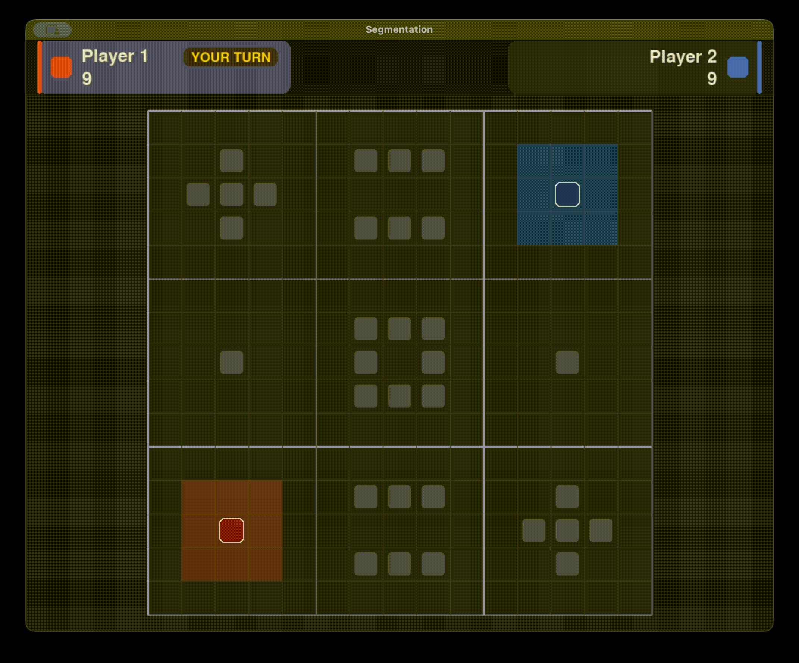

<!--
========================================================================================================================

    This is a Markdown file. If you are using VS Code, right-click this file and click "Open Preview" to render it!
    
========================================================================================================================
-->

# CS182 Individual Programming Assignment 1: Segmentation

| [`README`] | [`Installation`](/docs/1-installation.md#installation) | [`Game Overview`](/docs/2-game-overview.md#game-overview) | [`Individual Tasks`](/docs/3-individual-tasks.md#individual-tasks) | [`Getting Started`](/docs/4-getting-started.md#getting-started) |
| :---: | :---: | :---: | :---: | :---: |

 

Welcome to the CS182 Arcade! Over the course of the semester, we'll be taking a deeper dive into many of the topics covered in lecture through individual and group programming assignments. In particular, we will apply the knowledge you've learned in class to plan and train agents for games.

For this series of assignments, we're especially interested in diving deep into the topic of adversarial search. To get started, we have split this `README` into a series of articles, which you can navigate at the top. As always, we highly recommend reading through the entire assignment and the stencil code before you start writing code.

<figure style="text-align: center;">
    
</figure>

## Code Structure

This repository contains four major directories of interest:

### `scripts`

We've created a variety of helpful scripts to aid in the development of your agents.

- The `creator.py` script provides a simple GUI to edit existing worlds and create new ones that you can test your implementations out on. Run `uv run scripts/creator.py -h` for more details.

### `src`

All code that you will be responsible for belongs here. In particular, you will be implementing various agents that will face off against bots provided by the TAs. In general, refrain from making *destructive* edits to the stencil code to ensure compatibility with the autograder. Adding new files, functions, and methods is encouraged! External third-party dependencies are not allowed, but feel free to import any built-in Python module.

As you work through this assignment, you may want to examine the exports of the `segmentation_core` package, which contains all the game logic for this assignment. You can view documentation for relevant classes, methods, and functions by:

- locating their type stubs in the package (in VS Code, you can `Ctrl`/`Cmd`-click on the package itself or on objects like `Player`),
- or using `help(object)` in a Python REPL (import the package and then call `help` on your desired class, method, or function).

Some doc comments have also been replicated at `docs/comments.md` for your convenience. If you have any questions about how things work, please feel free to post a question on [Ed](https://edstem.org/us/courses/82550/discussion)!

### `tests`

We've provided some simple local tests to debug your implementations before submitting to Gradescope. The tests we have provided are a strict subset of those used by our autograder on Gradescope. You can run these tests by executing `uv run pytest`. We recommend that you write your own tests as well!

### `worlds`

All of the TA-provided world files used for the local tests are located in this directory. We also recommend keeping your own custom world files here for organizational purposes.

 

---

| [`Back to top`](#cs182-individual-programming-assignment-1-segmentation) | [`Installation` →](/docs/1-installation.md#installation) |
| :---: | ---: |
