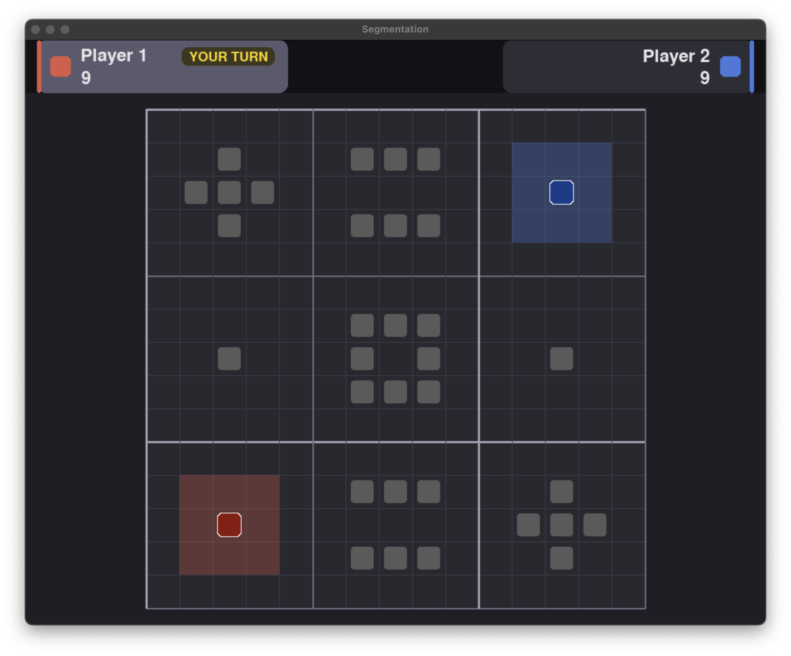
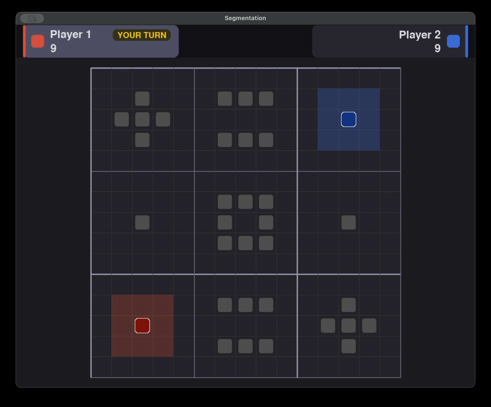

<!--
========================================================================================================================

    This is a Markdown file. If you are using VS Code, right-click this file and select "Open Preview" to render it!
    
========================================================================================================================
-->

# Game Overview

| [`README`](/README.md#cs182-individual-programming-assignment-1-segmentation) | [`Installation`](/docs/1-installation.md#installation) | [`Game Overview`] | [`Individual Tasks`](/docs/3-individual-tasks.md#individual-tasks) | [`Getting Started`](/docs/4-getting-started.md#getting-started) |
| :---: | :---: | :---: | :---: | :---: |

 

For both the individual and group portions of the assignment, you'll be playing a two-player, turn-based, zero-sum game of perfect information on a discrete gridworld. Those are a lot of keywords, so let's break it down:

- A *two-player* game is one in which there are exactly two players, possibly cooperating or competing. For this assignment, you will be tasked to develop agents which will be faced against bots provided by the teaching staff (for the graded portions) and agents written by your classmates (for the tournament)!

- A *turn-based* game is one in which players take turns one after another rather than simultaneously. We'll explore simultaneous games in future assignments.

- A *zero-sum* game is one in which any gain for one player is accompanied by an equivalent loss for the other player. For a non-zero-sum game, see the [prisoner's dilemma](https://en.wikipedia.org/wiki/Prisoner%27s_dilemma).

- A game of *perfect information* is one in which each player is aware of all relevant information when making any decision. Whether a player has perfect or imperfect information can really affect their optimal strategy. For example, Battleship would be an extremely boring game if it were of perfect information!

- A game on a *discrete gridworld* is one in which each player controls an agent positioned on a tiled grid.

 

## World Structure

In this game, the world is represented by a discrete grid with $W$ columns and $H$ rows. Tiles in this grid are zero-indexed, with the origin at the top-left corner. We denote positions in the grid as $(x, y)$ pairs, where $x$ is the column index and $y$ is the row index. For example, in the following grid, player 1 is located at $(2, 12)$. Each world is specified by its width and height, the positions of all walls, and the initial positions of each player.

<figure style="text-align: center;">
    
    <figcaption style="font-style: italic;">
        Player 1 and player 2 are represented as dark red and dark blue rounded squares, respectively. Walls are shown as gray rounded squares.
    </figcaption>
</figure>

 

## Player Movement

On a player's turn, they can take one of five actions:

- `Action.UP`
- `Action.DOWN`
- `Action.LEFT`
- `Action.RIGHT`
- `Action.STAY`

Each action attempts to move the agent in the corresponding direction, except for `Action.STAY` which causes the agent to stay in place. If an agent attempts to move into a wall or outside the board, it stays in place and forfeits its turn.

 

## Claiming Tiles

Each agent has a set of `claims`, which initially consists of all tiles in a $3 \times 3$ radius, excluding walls. As an agent moves onto tiles outside its claims, the agent leaves a `trail` behind itself. Once an agent moves back into its claims, it *completes its trail*, claiming all tiles on and enclosed by this trail. Note that this can include the enemy's claims!

<figure style="text-align: center;">
    
    <figcaption style="font-style: italic;">
        Claims are shown as shaded tiles, and trails are shown as bright circles, matching the colors of their respective players.
    </figcaption>
</figure>

 

## Eliminating Agents

An agent can be eliminated in one of the following ways:

1. If an agent moves into the opposing agent's trail, the latter is eliminated.
2. If an agent moves into its own trail, it is eliminated.
3. If an agent moves into the tile containing the opposing agent, the latter is eliminated.
4. When an agent completes its trail, if the opposing agent is inside the newly claimed region, the enclosed agent is eliminated.

 

## Winning the Game

A player wins if either their agent has claimed a majority of available tiles or the opposing agent has been eliminated.

<figure style="text-align: center;">
    
    <figcaption style="font-style: italic;">
        “Move swift as the Wind and closely-formed as the Wood. Attack like the Fire and be still as the Mountain.” —Sun Tzu
    </figcaption>
</figure>

 

---

| [← `Installation`](/docs/1-installation.md#installation) | [`Back to top`](#game-overview) | [`Individual Tasks` →](/docs/3-individual-tasks.md#individual-tasks) |
| :--- | :---: | ---: |
